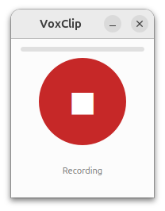
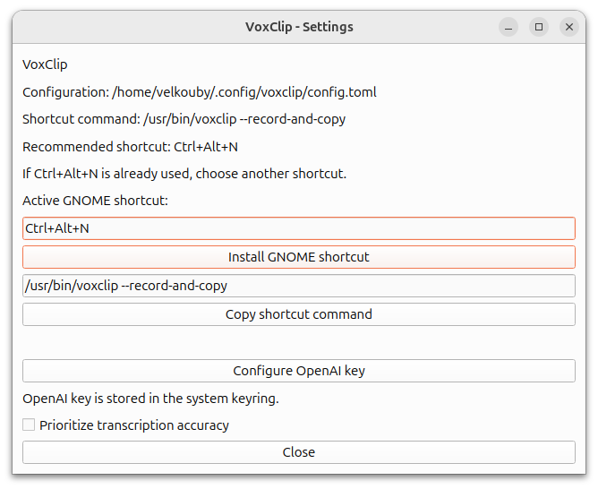

# VoxClip

VoxClip is a small Ubuntu desktop dictation app. It opens a compact recorder,
streams microphone audio to OpenAI Realtime transcription, copies the final
transcript to the clipboard, and lets you paste it manually with `Ctrl+V`.

VoxClip does not simulate keystrokes or paste automatically. This keeps the app
reliable on GNOME and Wayland, where automatic paste injection is fragile.

## Screenshots




## Author and Contact

- Author: Vincent Elkouby
- GitHub: https://github.com/velkouby
- If you use or redistribute this project, cite: **Vincent Elkouby (GitHub: velkouby)**

## How It Works

1. Put the cursor in the text field where you want to dictate.
2. Launch VoxClip, usually with the configured Ubuntu keyboard shortcut.
3. Speak while the recorder window is open.
4. Press `Enter` or click the stop button to finish.
5. VoxClip copies the final transcript to the clipboard.
6. Paste it yourself with `Ctrl+V`.

`Escape` cancels the current dictation without changing the clipboard. Empty
transcripts are not copied.

## Requirements

- Ubuntu with a desktop session, preferably GNOME on Wayland or X11.
- Python 3.12 or newer, provided by the system for the Debian package.
- A working microphone.
- An OpenAI API key for real transcription.
- Clipboard helpers installed by the Debian package dependencies:
  `wl-clipboard`, `xclip`, or `xsel`.

## Install From A Debian Release

The recommended installation path is the prebuilt Debian package attached to a
GitHub release. For release `v0.2.0`, the expected asset name is:

```text
voxclip_0.2.0_amd64.deb
```

Repository-hosted Debian artifacts are stored in [`releases/`](releases/) and
listed in [releases/README.md](releases/README.md). From a clone, you can
install the latest generated package with:

```bash
sudo apt install ./releases/voxclip_latest_amd64.deb
```

Download it from the GitHub release page, or use the GitHub CLI from a clone of
the repository:

```bash
gh release download v0.2.0 --pattern "voxclip_0.2.0_amd64.deb" --clobber
```

If you are not inside a clone, pass the repository explicitly:

```bash
gh release download v0.2.0 \
  --repo velkouby/voxclip \
  --pattern "voxclip_0.2.0_amd64.deb" \
  --clobber
```

You can also download the asset directly with `curl`:

```bash
curl -LO "https://github.com/velkouby/voxclip/releases/download/v0.2.0/voxclip_0.2.0_amd64.deb"
```

Install the package:

```bash
sudo apt update
sudo apt install ./voxclip_0.2.0_amd64.deb
```

Then open the settings window:

```bash
voxclip --settings
```

To uninstall:

```bash
sudo apt remove voxclip
```

To also remove the managed GNOME shortcut and autostart entry:

```bash
voxclip --remove-ubuntu-shortcut
```

User configuration and the OpenAI key are intentionally left in the user config
directory and system keyring. To reset them manually:

```bash
rm -rf ~/.config/voxclip
voxclip --delete-openai-key
```

## Configure The OpenAI Key

The OpenAI API key is never written to `config.toml`. VoxClip stores it in the
system keyring.

You can set it from the UI:

```bash
voxclip --settings
```

Or from the command line:

```bash
voxclip --set-openai-key
voxclip --check-openai-key
voxclip --delete-openai-key
```

If you start a real dictation without a stored key, VoxClip prompts for one
before opening the recorder.

## Configure The Keyboard Shortcut

The installed recorder command is:

```bash
/usr/bin/voxclip --record-and-copy
```

The recommended shortcut is:

```text
Ctrl+Alt+N
```

Install or update the managed GNOME shortcut:

```bash
voxclip --set-ubuntu-shortcut
```

Choose a different shortcut:

```bash
voxclip --set-ubuntu-shortcut Ctrl+Alt+K
```

VoxClip also creates a user autostart entry so the managed GNOME shortcut is
re-applied when you log in.

## Usage

Start a dictation from the installed package:

```bash
voxclip --record-and-copy
```

Open settings:

```bash
voxclip --settings
```

Run an environment diagnostic without exposing secrets, audio, or transcripts:

```bash
voxclip --diagnose
```

List detected audio input devices:

```bash
voxclip --list-audio-devices
```

## Parameters

VoxClip uses two layers of configuration:

- CLI flags for launching and key actions
- `~/.config/voxclip/config.toml` for persistent behavior

### CLI flags

- `--record-and-copy` (open the recorder and start dictation)
- `--settings` (open settings window)
- `--mock` (mock audio/transcription for development)
- `--set-openai-key`, `--delete-openai-key`, `--check-openai-key`
- `--set-ubuntu-shortcut [KEY_COMBO]` (default: `Ctrl+Alt+N`)
- `--remove-ubuntu-shortcut`
- `--ensure-ubuntu-shortcut` (reinstall the managed shortcut)
- `--list-audio-devices`
- `--diagnose`

### Advanced config file parameters

You can edit `~/.config/voxclip/config.toml` manually if needed:

```toml
transcription_model = "gpt-realtime-whisper"
transcription_language = "fr"
transcription_delay = "low"
ubuntu_shortcut = "Ctrl+Alt+N"
```

- `transcription_model`: OpenAI Realtime model used for dictation.
- `transcription_language`: optional source language override (`en`, `fr`, etc.).
- `transcription_delay`: delay/latency/accuracy trade-off.
  Valid values are `minimal`, `low`, `medium`, `high`, `xhigh`.
- `ubuntu_shortcut`: GNOME shortcut that launches dictation.

## OpenAI Cost

VoxClip streams microphone audio to OpenAI Realtime transcription.
The default model is `gpt-realtime-whisper`, priced at **$0.017 per minute**
on the official OpenAI pricing docs. A quick estimate is:

- 10 minutes: `$0.17`
- 1 hour: `$1.02`

The final bill depends on your usage and OpenAI's current rate card.

## Development

Install development dependencies:

```bash
uv sync --all-extras --dev
```

Run the app from source:

```bash
uv run voxclip
uv run voxclip --record-and-copy
```

Run the mock recorder without a microphone or OpenAI key:

```bash
uv run voxclip --record-and-copy --mock
```

In a headless environment:

```bash
QT_QPA_PLATFORM=offscreen uv run voxclip --record-and-copy --mock
```

Run checks:

```bash
uv run pytest
uv run ruff check .
```

Build a local Debian package:

```bash
uv run python packaging/build_deb.py
sudo apt install ./dist/voxclip_0.2.0_amd64.deb
```

Generate repository release artifacts and refresh `RELEASES.md`:

```bash
./generate_new_release.sh
```

If the required wheels are already available in the local `uv` cache, the Debian
package can be built offline:

```bash
uv run python packaging/build_deb.py --offline
```

## Project Names

- Python distribution: `voxclip`
- Python package: `vox_voice_paste`
- User command: `voxclip`
- Debian package: `voxclip`

## Privacy And Security

- The OpenAI API key is stored in the system keyring, not in the config file.
- Diagnostics report whether a key exists but never print the key.
- VoxClip does not persist microphone audio to disk.
- VoxClip does not keep a local transcript history by default.
- Technical logs avoid transcript, audio, and secret content.

## License

VoxClip is open source software distributed under the MIT License. See
[LICENSE](LICENSE).
